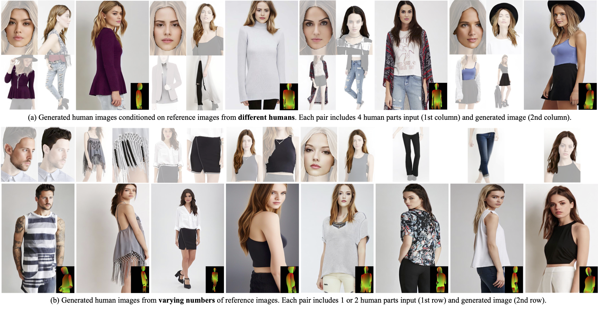

# Parts2Whole

[Arxiv 2024] From Parts to Whole: A Unified Reference Framework for Controllable Human Image Generation

> Preparing the stable model... Stay tuned!

## 🏠 <a href="https://huanngzh.github.io/Parts2Whole/" target="_blank">Project Page</a> | <a href="" target="_blank">Paper</a>



Abstract: _We propose Parts2Whole, a novel framework designed for generating customized portraits from multiple reference images, including pose images and various aspects of human appearance. We first develop a semantic-aware appearance encoder to retain details of different human parts, which processes each image based on its textual label to a series of multi-scale feature maps rather than one image token, preserving the image dimension. Second, our framework supports multi-image conditioned generation through a shared self-attention mechanism that operates across reference and target features during the diffusion process. We enhance the vanilla attention mechanism by incorporating mask information from the reference human images, allowing for precise selection of any part._

## 🔨 Method Overview


## 🤝 Acknowledgement

We appreciate the open source of the following projects:

[diffusers](https://github.com/huggingface/diffusers) &#8194;
[magic-animate](https://github.com/magic-research/magic-animate) &#8194;
[Moore-AnimateAnyone](https://github.com/MooreThreads/Moore-AnimateAnyone) &#8194;
[DeepFashion-MultiModal](https://github.com/yumingj/DeepFashion-MultiModal) &#8194;
[Real-ESRGAN](https://github.com/xinntao/Real-ESRGAN)

## 📎 Citation

If you find this repository useful, please consider citing:

```

```
